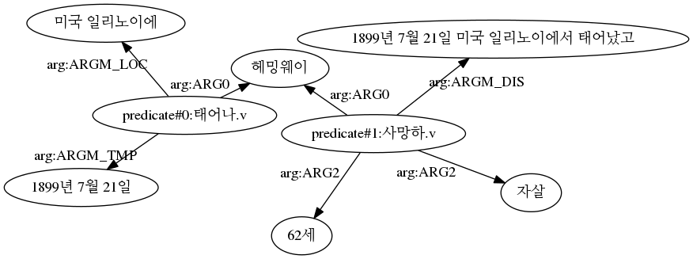

# Teddy_SRL

## About
Teddy_SRL is a **span-based** semantic role labeling (SRL) module for Korean text. 
It is based on BERT model (`bert-base-multilingual-cased`) , and was trained by using the Korean PropBank data which is modified by Lee et al., (2015)

## prerequisite
* `python 3`
* `pytorch` ([Link](https://pytorch.org/))
* `transformers` ([Link](https://github.com/huggingface/transformers/tree/9a0a8c1c6f4f2f0c80ff07d36713a3ada785eec5#installation))
* `konlpy` ([Link](https://d-e-v.tistory.com/9))
* `flask_restful` (for REST API service)
* `flask_cors` (for REST API service)

## How to Install 
**Install**
```
git clone https://github.com/teddysum/teddy_srl.git
```

## How to use

**Download the pretrained model**

Download two pretrained model files to `{your_model_dir}` (e.g. `/home/model/bert_ko_srl_model.pt`). 
* **Download:** ([click](https://drive.google.com/drive/folders/1cnVStyc1CDCV1PkkJAkdmGTtiAEmplUL?usp=sharing))

**Note** that there are two files: `config.json` and `pytorch_model.bin`

**Import srl_based_parser (in your python code)**
(make sure that your code is in a parent folder of teddy_srl)
```
from teddy_srl import parser

model_dir = {your_model_dir} # absolute_path (e.g. /home/model/teddy_srl)
srl_parser = parser.srl_parser(model_dir=model_dir)
```

**parse the input text**
```
text = '헤밍웨이는 1899년 7월 21일 미국 일리노이에서 태어났고 62세에 자살로 사망했다.'
parsed = srl_parser.ko_srl_parser(text)
```

## Result Format

***conll-like format***

The result is a list, which consists of multiple SRL structures. Each SRL structure is in a list, which consists of three lists: (1) tokens, (2) predicates, and (3) arguments. For example, for the given input text, the output is in the following format:

```
print(parsed['conll'])
```
```
[ 
    [
        ['헤밍웨이는', '1899년', '7월', '21일', '미국', '일리노이에서', '태어났고', '62세에', '자살로', '사망했다.']
        ['_', '_', '_', '_', '_', '_', '태어나.v', '_', '_', '_']
        ['B-ARG0', 'B-ARGM_TMP', 'I-ARGM_TMP', 'I-ARGM_TMP', 'B-ARGM_LOC', 'I-ARGM_LOC', 'O', 'O', 'O', 'O']
    ],

    [
        ['헤밍웨이는', '1899년', '7월', '21일', '미국', '일리노이에서', '태어났고', '62세에', '자살로', '사망했다.']
        ['_', '_', '_', '_', '_', '_', '_', '_', '_', '사망하.v']
        ['B-ARG0', 'B-ARGM_DIS', 'I-ARGM_DIS', 'I-ARGM_DIS', 'I-ARGM_DIS', 'I-ARGM_DIS', 'I-ARGM_DIS', 'B-ARG2', 'B-ARG2', 'O']
    ]
]
```
where the first annotation is a SRL for the verb '태어나.v', and second is for the verb '사망하.v'. 

***triple format (as a Graph)***
The result is a list of triples.
```
print(parsed['graph'])
```
```
[
    ('predicate#0:태어나.v', 'arg:ARG0', '헤밍웨이'),
    ('predicate#0:태어나.v', 'arg:ARGM_TMP', '1899년 7월 21일'),
    ('predicate#0:태어나.v', 'arg:ARGM_LOC', '미국 일리노이에'),
    ('predicate#1:사망하.v', 'arg:ARG0', '헤밍웨이'),
    ('predicate#1:사망하.v', 'arg:ARGM_DIS', '1899년 7월 21일 미국 일리노이에서 태어났고'),
    ('predicate#1:사망하.v', 'arg:ARG2', '62세'),
    ('predicate#1:사망하.v', 'arg:ARG2', '자살')]
```

The graph could be visualized.
```
import pygraphviz as pgv
from IPython.display import Image

def visualize(graph):
    
    G = pgv.AGraph(directed=True, overlap=False)
    labels = {}
    
    for s,p,o in graph:
        if '-' in p:
            p = 'arg:'+p.split('-')[-1]
        G.add_edge(s,o, label=p)
        
    G.layout()    
    G.draw('dummy.png')  

visualize(parsed['graph'])
Image('dummy.png')
```



## Performance

The model is evaluated for argument identification task, in terms of Accuracy and F1. 
```
accuracy: 0.8513605783713224
F1: 0.6737581328100796

             precision    recall  f1-score   support

       ARGA       0.73      0.68      0.70        28
       ARG1       0.72      0.75      0.74      3332
   ARGM_TMP       0.64      0.69      0.67       881
       ARG0       0.69      0.78      0.73      1444
       ARG2       0.69      0.70      0.69       911
   ARGM_INS       0.27      0.34      0.30       119
   ARGM_DIS       0.31      0.42      0.35       546
   ARGM_LOC       0.55      0.65      0.60       205
   ARGM_CND       0.31      0.47      0.37        81
        AUX       0.97      0.96      0.96       758
   ARGM_EXT       0.68      0.60      0.64       201
   ARGM_ADV       0.42      0.38      0.40       166
   ARGM_DIR       0.14      0.14      0.14        14
   ARGM_CAU       0.26      0.33      0.29       187
   ARGM_MNR       0.51      0.60      0.55       201
   ARGM_PRP       0.33      0.47      0.39        70
       ARG3       0.56      0.62      0.59        78
   ARGM_PRD       0.15      0.23      0.18        56
   ARGM_NEG       0.00      0.00      0.00         3

avg / total       0.66      0.70      0.68      9281

```

## Running REST API service

By running the code `restApp.py`, you can make a standalone REST service at your own server.

### How to run REST API service
```
python restApp.py --port {port number} --model {model path}
```
**Example**
```
python restApp.py --port 9001 --model ./models/teddy_srl
```
Then, you can use it with the `POST` method to the url `XXX.XXX.XXX.XXX:9001/teddy_srl`. `XXX.XXX.XXX.XXX` is your IP address. 

```
import request

url = 'http://localhost:9001/teddy_srl'
response = requests.post(url, data=d)
a = response.json()
pprint(a)
```

### Input format
```
# JSON format
{
 "text": "Hemingway was born on July 21, 1899 in Illinois, and died of suicide at the age of 62.",
 "result_format": "all"
}
```


## REFERENCE
Changki Lee, Soojong Lim, Hyunki Kim. Korean Semantic Role Labeling Using Structured SVM. In Proceddings of the KIISE Korea Computer Congress 2015, 42.2: 220-226. (in Korean)

Jangseong Bae, Changki Lee, Hyunki Kim. Korean Semantic Role Labeling with Highway BiLSTM-CRFs. HCLT, 2017, 159-162. (in Korean)

## Copyright
* Copyright 2021. (주)테디썸. all rights reserved.

## Publisher
Teddysum

## Contact
Younggyun Hahm, CEO of Teddysum. `hahmyg@teddysum.ai`
